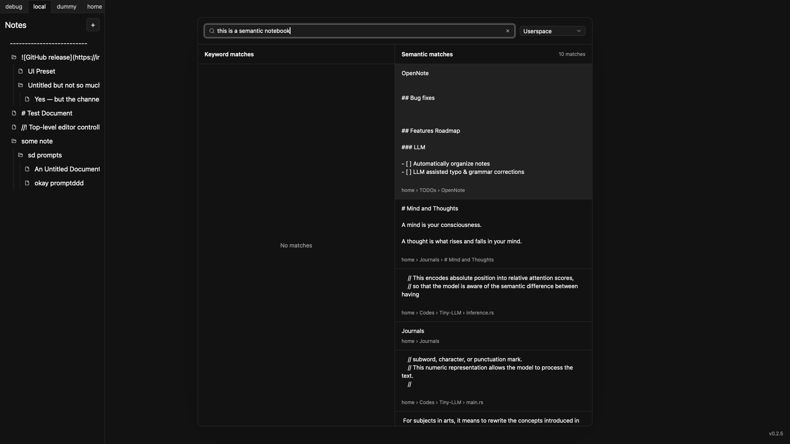

# OpenNote

A block-based, AI-powered note-taking app with semantic search — built entirely in Rust.

**Status: Heavy Development** — APIs, architecture, and workflows are evolving quickly. Contributions, feedback, and experimental use are all welcome.

<div align="center">
  
</div>

## Features

- **Keyword and semantic search** — find notes instantly, or let your documents answer your questions.
- **Fully local** — everything runs on your machine. Your data stays private.
- **Self-host server** — you can opt to run a self-hosted server to sync data across all of your devices with encrypted communications.
- **WYSIWYG Markdown Editor** — editor and render your markdown in real-time.
- **Blazing fast** — built for performance from the ground up.

## Roadmap

- [x] Self-hosted server for syncing documents across devices with encrypted communications
- [x] WYSIWYG markdown editor integration
- [ ] Advanced NLP features to simplify document management (e.g., automatic categorization by semantic similarity)
- [ ] LLM integrations — local-first, always
- [x] MCP server support
- [ ] Import webpages, databases and files
- [ ] Multi-modal support

## Getting Started

1. Visit the [Releases page](https://github.com/opennote-org/opennote/releases).
2. Download the archive for your operating system.
3. Unzip the archive.
4. Double-click to launch the app.
5. Enjoy!

**For mac users**: I don't have an Apple Developer Account yet, so I can't codesign the mac app. You may need to run the following command in Terminal, after pasting the app file to the `Applications` folder:

**For first-time installation**: The app will try downloading `models--sentence-transformers--all-MiniLM-L6-v2` from `https://huggingface.co` by default. However, in case if the official site fails, it will switch to use a mirror site, which is `https://hf-mirror.com`.

```bash
sudo xattr -r -d com.apple.quarantine /Applications/opennote.app
```

### Configure the Desktop App

You can configure OpenNote with its `configurations.json`. It can be found here:

```bash
# on macOS
"/Users/yourusername/Library/Application Support/opennote/configurations.json"

# on Linux
"/home/yourusername/.config/opennote/configurations.json"

# on Windows
"C:\Users\Alice\AppData\Roaming\opennote\configurations.json"
```

However, you may also open the configuration editor by pressing `CMD + ;` on macOS, or `Ctrl + ;` on Windows and Linux.

### Setup Remote Server

You may host a remote server for syncing across different computers securely. To achieve this, refer to [README.md of opennote-server](crates/opennote-server/README.md).

### Use the MCP Server

The MCP server is **enabled by default** and listens on `http://localhost:8080/`. Toggle it and change its address in `configurations.json` under `user.mcp_server`, or open the configuration editor with `Cmd + ;` on macOS / `Ctrl + ;` on Windows and Linux:

```json
{
  "mcp_server": {
    "enabled": true, // start the MCP server when the app launches (default `true`)
    "host": "localhost", // address the server binds to (default `localhost:8080`)
    "port": 8080,
    "workers": 2 // number of actix-web worker threads (default `2`)
  }
}
```

Point any MCP client that supports the Streamable HTTP transport at the server's URL. For example, add this to your client's MCP configuration:

```json
{
  "mcpServers": {
    "opennote": {
      "url": "http://localhost:8080/"
    }
  }
}
```

The server is loopback-only by default: it accepts requests whose `Host` header is a loopback address, which protects the locally running server from DNS-rebinding attacks. It is intended to be used from the same machine that runs OpenNote. The desktop MCP server does not require authentication.

## Contributing

OpenNote is in active development and welcomes contributions of all kinds — bug reports, feature ideas, code, documentation, and design.

- Open issues and pull requests on GitHub
- Explore the crate documentation in the source
- Reach out with questions or ideas

## Credits

Kudos to all the libraries used in this project. See the full list in [Cargo.toml](./Cargo.toml) and in the `Cargo.toml` of each sub-crate.

Thanks to [appify](https://github.com/akx/appify) for bundling the executable as a macOS app.

Thanks to [sqlite](https://sqlite.org) for localizing relational database.

Thanks to [sqlite-vector](https://github.com/sqliteai/sqlite-vector) for localizing vector storages.

Thanks to [velotype](https://github.com/manyougz/velotype) for WYSIWYG markdown editor.

## License

MIT — see [LICENSE](./LICENSE).

This project includes code derived from [Zed](https://zed.dev) under the Apache 2.0 license — see [NOTICE.md](./NOTICE.md).
